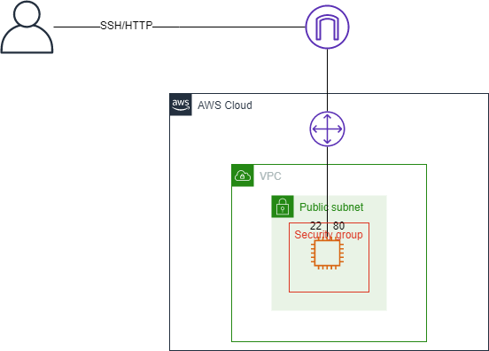

# PROJECT DESCRIPTION

This repo contains all the module created via terraform in my trainning with deploying insfra on AWS.

## 1 EC2 VPC IG SSH

VPC with a private subnet with an EC2 instance with internet gateway.
EC2 expose port 80 for http protocol and 22 for SSH.